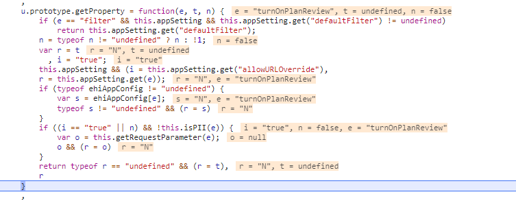

# MEDI-26100

A/B TEST

1.进入Adobe Target  
2.Create Activity -> A/B TEST -> 选择Form -> 设置Experiences -> LOCATION选择ehi:mc:enrollment:plan-review -> CONTENT如下  
```javascript
<script>
    if(typeof setAppConfigProperty === "function") {
        setAppConfigProperty("turnOnPlanReview", "Y");
    }
</script>
```
-> 根据情况设置Experience B的turnOnPlanReview为N -> 设置Targeting -> 设置Goals & Settings  
-> 设置Report Suite为QA | Global | All | EHI EHM -> 设置Goal Metric*  
-> 两个框分别设置为Use an Analytics metric和Submit(Application) -> 其它默认 -> 保存  

调试结果  
  
调试发现turnOnPlanReview从app-setting中取出为Y，但是后来又被ehiAppConfig赋值为N，在muse中发现定义了一段代码
```javascript
function setAppConfigProperty(prop, val) {
    ehiAppConfig.set(prop, val);
}
```
方法名和adobe中设置的方法名一样，发现原来adobe中把turnOnPlanReview赋值到ehiAppConfig中，并且shouldShowPlanReview这个方法最后读取的turnOnPlanReview是从ehiAppConfig中得到，
所以设置adobe的流量为五五开，这样就完成了turnOnPlanReview的A/B TEST。

# 修改content app

在contentAmoy上改，挂到issue上，然后跑 https://eng-jenkins.ehealthinsurance.com/view/Normal-Release/job/Normal-ContentAmoy2Develop/这个job
会从contentAmoy merge到develop  
develop -> master: https://eng-jenkins.ehealthinsurance.com/view/Normal-Release/job/Normal-CM-Release/  
分支与环境的对应关系：develop -> QA/QP master -> CM/PROD  
https://eng-jenkins.ehealthinsurance.com/view/Normal-Release/job/Normal-ContentPush-CM/  
Normal-ContentPush-CM - 只是单纯的push content 文件，不做merge 操作  
Normal-CM—Release - 会执行database，还有content的merge，最后push content 到cm 环境  

# QA上所有的case都是call to enroll
刚才那个enroll不了的问题是因为mose在读取scheme节点的时候都会用驼峰格式来读取节点名，然后shelley那边有个提交的字段名不是驼峰，导致读不到对应的节点（比如selectPCP节点用selectPcp去读取），从而get applicationData失败

# castro创建app，xml信息怎么走？
1.start application 的时候，会创建一个 xml 出来，这个 xml 只有 other-data 的信息  
2.submit application 之后，会创建一个大而全的 xml 出来，这个 XML 包容万象，core-data/other-data/license-info/...  
other-data xml: /archiveEnc/AppOtherData/  
full xml: /archiveEnc/XMLArchive/  

# 想查询某个3scale api对应的哪类host的哪个api
见工具 https://api-admin.ehealth.com/view/urlMapping  

# 环境
cdca: team19