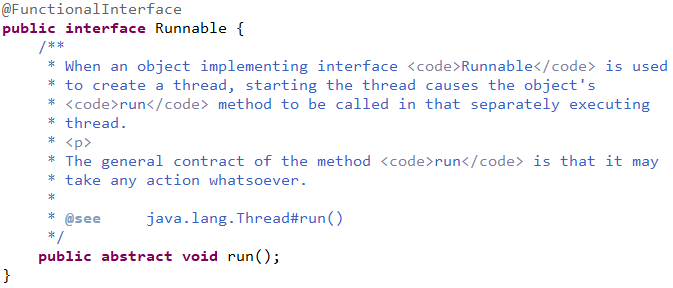

## jvm jre jdk
JVM ：英文名称（Java Virtual Machine），就是我们耳熟能详的 Java 虚拟机。它只认识 x.class 这种类型的文件，它能够将 class 文件中的字节码指令进行识别并调用操作系统向上的 API 完成动作。所以说，jvm 是 Java 能够跨平台的核心，具体的下文会详细说明。

JRE ：英文名称（Java Runtime Environment），我们叫它：Java 运行时环境。它主要包含两个部分，jvm 的标准实现和 Java 的一些基本类库。它相对于 jvm 来说，多出来的是一部分的 Java 类库。

JDK ：英文名称（Java Development Kit），Java 开发工具包。jdk 是整个 Java 开发的核心，它集成了 jre 和一些好用的小工具。例如：javac.exe，java.exe，jar.exe 等。

## Lambda表达式

### Demo
```java
public static void main(String[] args) {
    // 用匿名内部类的方式来创建线程
    new Thread(new Runnable() {
        @Override
        public void run() {
            System.out.println("Hello world!");
        }
    });

    // 使用Lambda来创建线程
    new Thread(() -> System.out.println("Hello world!"));
}
```
> 使用Lambda表达式创建线程的时候，并不关心接口名，方法名，参数名。我们只关注他的参数类型，参数个数，返回值。Lambda表达式返回的是接口的实例对象。

### Runnable接口



> `@FunctionalInterface`表示这是一个函数式编程接口

### 方法引用
```java
public class Demo {
    public static void main(String[] args) {
        // 一个入参，无返回值
        Consumer<String> consumerLambda = s -> System.out.println(s);
        consumerLambda.accept("Bruce Wayne1");
        
        // 两个入参，无返回值
        BiConsumer<String, Integer> biConsumerLambda = (s, i) -> System.out.println(s+i);
        biConsumerLambda.accept("Bruce wayne", 11);

        // 无入参，有返回值
        Supplier<String> supplierLambda = () -> "Bruce wayne2";
        System.out.println(supplierLambda.get());

        // 静态方法引用--通过类名调用
        Consumer<String> consumerStatic = User::myNameStatic;
        consumerStatic.accept("Bruce Wayne3");

        // 实例方法引用--通过实例调用
        User user = new User();
        Consumer<String> consumerInstance = user::myNameInstance;
        consumerInstance.accept("Bruce Wayne4");

        // 构造方法方法引用--无参数
        Supplier<User> batman = User::new;
        System.out.println(batman.get());
    }
}
```
```java
class User {
    // 静态方法
    public static void myNameStatic(String name) {
        System.out.println(name);
    }

    // 实例方法
    public void myNameInstance(String name) {
        System.out.println(name);
    }

    // 无参构造方法
    public User() {
    }
}
```

## 泛型

泛型方法 / 泛型类 / 泛型接口

### 泛型方法

```java
public class TestGenericMethod {
    // 泛型方法printArray
    public static <E> void printArray(E[] inputArray) {
        // 输出数组元素            
        for(E element : inputArray) {
            System.out.printf("%s ", element);
        }
        System.out.println();
    }
 
    public static void main(String args[]) {
        // 创建不同类型数组：Integer, Double, Character
        Integer[] intArray = {1, 2, 3, 4, 5};
        Double[] doubleArray = {1.1, 2.2, 3.3, 4.4};
        Character[] charArray = {'H', 'E', 'L', 'L', 'O'};
        
        // 传递一个整型数组
        printArray(intArray);

        // 传递一个双精度型数组
        printArray(doubleArray);

        // 传递一个字符型数组
        printArray(charArray);
    }
}
```

### 类型参数有界的泛型方法

```java
public class TestMaximum {
    // 比较三个值并返回最大值，此处类型T限制为Comparable的子类
    public static <T extends Comparable<T>> T maximum(T x, T y, T z) {
        T max = x; // 假设x是初始最大值
        if (y.compareTo(max) > 0) {
            max = y; // y更大
        }
        if (z.compareTo(max) > 0) {
            max = z; // 现在z更大
        }
        return max; // 返回最大对象
    }
    public static void main(String args[]) {
        System.out.printf("%d, %d 和 %d 中最大的数为%d\n\n", 3, 4, 5, maximum(3, 4, 5));
 
        System.out.printf("%.1f, %.1f 和 %.1f 中最大的数为%.1f\n\n", 6.6, 8.8, 7.7, maximum(6.6, 8.8, 7.7));
 
        System.out.printf("%s, %s 和 %s 中最大的数为%s\n","pear", "apple", "orange", maximum("pear", "apple", "orange"));
    }
}
```

### 泛型类

```java
public class Box<T> {
    private T t;
 
    public void add(T t) {
        this.t = t;
    }

    public T get() {
        return t;
    }

    public static void main(String[] args) {
        Box<Integer> integerBox = new Box<Integer>();
        Box<String> stringBox = new Box<String>();
 
        integerBox.add(new Integer(10));
        stringBox.add(new String("Bruce wayne"));
 
        System.out.printf("整型值为:%d\n\n", integerBox.get());
        System.out.printf("字符串为:%s\n", stringBox.get());
    }
}
```

### 类型通配符
- 一般用在方法的传参是集合，并且不确定集合是什么类型？
- <T> 和 <?> 的区别
  - <T> 主要用于类或方法上，<?> 主要用于变量上
  - <T> 可以认为是一个确定的类，<?> 可以认为是Object


```java
import java.util.*;
 
public class TestGeneric {
    // 类型通配符?代表了所有具体的类型
    public static void getData(List<?> data) {
        System.out.println("data :" + data.get(0));
    }
    // 限制了List中的类型只能是Number类及其子类
    // 下限通过形如List<? super Number>来定义，表示类型只能接受Number及其三层父类类型，如Object类型的实例
    public static void getUperNumber(List<? extends Number> data) {
        System.out.println("data :" + data.get(0));
    }

    public static void main(String[] args) {
        List<String> name = new ArrayList<String>();
        List<Integer> age = new ArrayList<Integer>();
        List<Number> number = new ArrayList<Number>();
        
        name.add("icon");
        age.add(18);
        number.add(314);
 
        getData(name);
        getData(age);
        getData(number);
        
        //getUperNumber(name); // 出错，name这个List中的成员不属于Number类及其子类
        getUperNumber(age);
        getUperNumber(number);
    }
}
```

## default关键字

> 用在接口的声明，表示接口可以有实现方法，并且不需要实现类去实现其方法

### 语法

```java
public interface Vehicle {
    default void print(){
        System.out.println("我是一辆车!");
    }
}
```

### 继承多个接口的情况

```java
interface Vehicle {
    default void print() {
        System.out.println("我是一辆车!");
    }
}
	 
interface FourWheeler {
    default void print() {
        System.out.println("我是一辆四轮车!");
    }
}

public class Car implements Vehicle, FourWheeler {
    // 第一个解决方案是创建自己的默认方法，来覆盖重写接口的默认方法
    public void print() {
        System.out.println("我是一辆四轮汽车!");
    }
    /* 第二种解决方案可以使用super来调用指定接口的默认方法
    public void print() {
        Vehicle.super.print();
    }
    */
}
```

### 静态默认方法

```java
interface Vehicle {
    default void print() {
        System.out.println("我是一辆车!");
    }
    // 静态方法
    static void blowHorn() {
        System.out.println("按喇叭!");
    }
}
	 
interface FourWheeler {
    default void print() {
        System.out.println("我是一辆四轮车!");
    }
}

class Car implements Vehicle, FourWheeler {
    public void print() {
        Vehicle.super.print();
        FourWheeler.super.print();
        Vehicle.blowHorn();
        System.out.println("我是一辆汽车!");
    }
}

public class TestDefault {
    public static void main(String args[]){
        Vehicle vehicle = new Car();
        vehicle.print();
    }
}
```

## Annotation

- @interface 表示实现 java.lang.annotation.Annotation 接口，即表示这是一个注解。
- 1 个 Annotation 必须和 1 个 RetentionPolicy 关联，用 @Retention 指定。
- 1 个 Annotation 必须和 1~n 个 ElementType 关联，用 @Target 指定。
- 1 个 Annotation 可以包含参数，在使用注解时指定入参。

```java
@Target({TYPE, FIELD, METHOD, PARAMETER, CONSTRUCTOR, LOCAL_VARIABLE})
@Retention(RetentionPolicy.SOURCE)
public @interface SuppressWarnings {
    String[] value();
}

public class SuppressWarningTest {

    // 由于 Date 被 @Deprecated 标注，在调用 new Date() 的方法添加 @SuppressWarnings 注解表示对 deprecation 的警告保持沉默
    // @SuppressWarnings 的 value 包含 deprecation，unchecked，all 等
    @SuppressWarnings(value={"deprecation"})
    public static void doSomething(){
        Date date = new Date(113, 8, 26);
        System.out.println(date);
    }

    public static void main(String[] args) {
        doSomething();
    }
}
```

# JVM

- JAVA 对象的创建过程
  - 类加载检查 -> 分配内存 -> 初始化零值 -> 设置对象头 -> 执行 init 方法

## 内存划分（运行时数据区）
- 方法区（JDK 1.8之后删除，同时增加元数据区，并且从运行时数据区域移到直接内存）
  - 被所有线程共享
  - 存储被虚拟机加载的元数据（Meta），包括类信息、常量、静态变量、即时编译器编译后的代码等数据
  - 包含常量池
  - 曾经 GC 分代收集拓展到了方法区，所以曾被称之为永久代，后在 Oracle JDK8 中移除，同时增加了元数据区（Metaspace）

- 堆
  - 被所有线程共享，虚拟机启动时生成堆
  - 几乎所有 JAVA 对象实例都是被直接分配到堆上
  - 物理不连续，逻辑连续
  - JDK 1.7之后常量池放在了堆里
  - GC的主要作用区域
  - GC过程会被划分为两个不同的区域：新生代（Young）、老年代（Old）
    - 新生代，又被划分成三个区域
      - Eden、From Survivor(S0)、To Survivor(S1)
      - Eden 和 S0/S1 的比值大概是 8:1:1
      - 一般新对象会被首先分配到 Eden 区，然后经过 GC 后如果对象还存活，则会到 S0 或者 S1，并且年龄加1，年龄大于15（默认为15），最后会到老年代
    - 老年代

- JAVA虚拟机栈
  - 线程私有，线程创建的同时创建JAVA虚拟机栈，生命周期与线程一致
  - 存储方法被调用直至执行完成所需的数据，包括局部变量、程序运行状态、方法返回值、方法出口等
  - 每次方法调用进行压栈，方法结束调用时出栈

- 本地方法栈
  - 线程私有，线程创建的同时创建JAVA虚拟机栈，生命周期与线程一致
  - 与JAVA虚拟机栈类似
  - JAVA虚拟机栈在执行JAVA方法（字节码）时使用，本地方法栈在调用Native时使用

- 程序计数器
  - 每个线程都有一个程序计数器
  - 存储当前正在执行JAVA方法的JVM指令地址，即字节码的行号
  - 如果正在执行Native方法，则这个计数器为空
  - 该内存区域是唯一一个在Java虚拟机规范中没有规定任何OOM情况的内存区域

## GC：垃圾回收，清理内存
### 垃圾回收类型
一种分法是
- Scavenge GC（Minor GC）：指发生新生代的垃圾收集动作，Minor GC 非常频繁，回收速度一般也比较快
- Full GC（Major GC）：指发生在老年代的GC，出现了 Major GC 经常会伴随至少一次的 Minor GC（并非绝对）
  - Young
  - Tenured
  - Perm
另一种分法是
- Minor GC 针对新生代GC
- Major GC 针对旧生代GC
- Full Gc 针对新生代GC、旧生代GC、老年代GC
### 判断对象是否死亡
- 引用计数法：给对象中添加一个引用计数器，每当有一个地方引用它，计数器就加1；当引用失效，计数器就减1；任何时候计数器为0的对象就是不可能再被使用的。
- 可达性分析算法：这个算法的基本思想就是通过一系列的称为 “GC Roots” 的对象作为起点，从这些节点开始向下搜索，节点所走过的路径称为引用链，当一个对象到 GC Roots 没有任何引用链相连的话，则证明此对象是不可用的。

### 垃圾回收算法
> “GC Root” 指的是 GC 的起点
- 复制（Copying）：
- 标记-清除（Mark-Sweep）：
- 标记-压缩（Mark-Compact）：
- 标记-清除-压缩（Mark-Sweep-Compact）：
- 分代收集算法：比如在新生代中，每次收集都会有大量对象死去，所以可以选择复制算法，只需要付出少量对象的复制成本就可以完成每次垃圾收集。而老年代的对象存活几率是比较高的，而且没有额外的空间对它进行分配担保，所以我们必须选择“标记-清除”或“标记-整理”算法进行垃圾收集。

### 垃圾收集器
> 垃圾收集算法是内存回收的方法论，垃圾收集器是内存回收的具体实现。